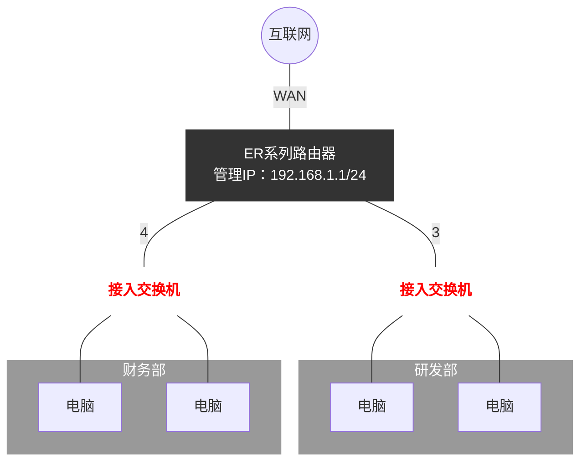
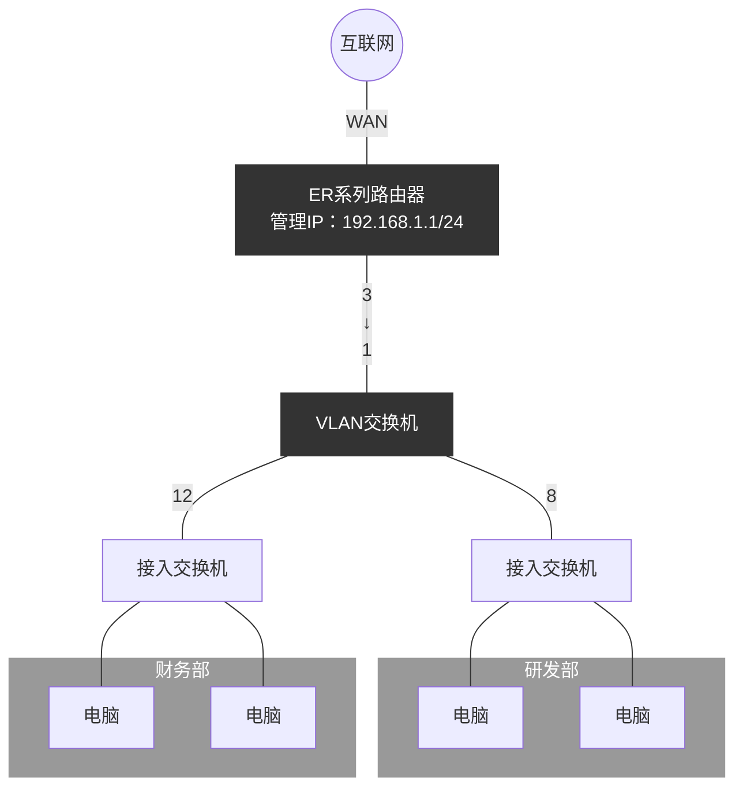

# ER系列路由器多 VLAN 划分设置指南

## ER系列路由器多网段划分设置指南

TP-LINK ER系列路由器支持划分多网段，可以针对不同的LAN接口划分网段，即每一个或多个LAN接口对应一个网段；也可以通过一个LAN接口与支持划分802.1Q VLAN的交换机进行对接，实现多网段划分。下面就这两种应用方式介绍必要的设置步骤。

---

## 针对LAN接口实现多网段划分

### 【应用拓扑结构】

*(注：上图中接入交换机分别对应 VLAN 2 : 192.168.2.1/24 (研发部) 和 VLAN 3 : 192.168.3.1/24 (财务部))*

注意：建议设置的电脑连接在路由器5号接口，该接口保持默认VLAN1。

针对上图所示的网络拓扑结构，基本设置步骤如下：

### （1）路由器添加VLAN

点击“**基本设置**”---“**VLAN设置**”，点击“**新增**”，新增vlan2，并设置相关参数。

**表单填写内容：**
*   **VLAN名称：** vlan2 （任意填写，本例中为“vlan2”）
*   **VLAN ID：** 2 （设置该VLAN的ID号，本例中为“2”）
*   **IP地址：** 192.168.2.1 （VLAN接口的IP地址，即内部网络的网关地址）
*   **子网掩码：** 255.255.255.0 （VLAN接口的子网掩码，与IP地址组合确定子网的范围）
*   **MAC地址：** （系统默认）
*   **管理接口：** ☑ 开启 （如果需要通过这个子网访问路由器界面，则勾选，如不需要，可不勾选）
*   **选择端口成员：**
    *   ☑ 端口3，出口规则：**UNTAG**

vlan3同理设置（VLAN ID: 3, IP: 192.168.3.1, 端口成员: 端口4 UNTAG）。设置完成，如下图所示：

| 序号 | VLAN名称 | VLAN ID | IP地址 | 子网掩码 | 端口成员 | 设置 |
| :--- | :--- | :--- | :--- | :--- | :--- | :--- |
| 1 | LAN | 1 | 192.168.1.1 | 255.255.255.0 | 3(UNTAG), 4(UNTAG), 5(UNTAG) | ✎ |
| 2 | vlan2 | 2 | 192.168.2.1 | 255.255.255.0 | 3(UNTAG) | ✎ 🗑 |
| 3 | vlan3 | 3 | 192.168.3.1 | 255.255.255.0 | 4(UNTAG) | ✎ 🗑 |

### （2）修改端口PVID

点击“**基本设置**”---“**端口设置**”，修改端口的PVID，如下图所示。

| 端口 | PVID | 所属VLAN |
| :--- | :--- | :--- |
| 端口1 | 4091 | 4091(UNTAG) |
| 端口2 | 4092 | 4092(UNTAG) |
| 端口3 | **2** | 2(UNTAG) |
| 端口4 | **3** | 3(UNTAG) |
| 端口5 | 1 | 1(UNTAG) |

*   端口3：本例中修改PVID为2；
*   端口4：本例中修改PVID为3；

设置完毕，点击“设置”，保存配置。至此VLAN设置完成。

### （3）添加新增的VLAN的DHCP服务器

点击“**基本设置**”---“**LAN设置**”---“**DHCP服务**”。点击“**新增**”，如下图所示。

**表单填写内容：**
*   **服务接口：** vlan2 （选择划分的vlan接口，本例中选择“vlan2”）
*   **开始地址：** 192.168.2.100 （填写开始地址）
*   **结束地址：** 192.168.2.200 （填写结束地址）
*   **地址租期：** 30 分钟
*   **网关地址：** 192.168.2.1 （可不填写，也可以填写，本例中设置“192.168.2.1”）
*   **缺省域名：** （不填写）
*   **首选DNS服务器：** 114.114.114.114 （填写当地的宽带线路的首选DNS，本例中设置电信公共DNS）
*   **备用DNS服务器：** 8.8.8.8 （填写当地的宽带线路的备用DNS，本例中设置谷歌公共DNS）
*   **Option60 / Option138：** （不填写）
*   **状态：** ☑ 启用 （勾选启用）

点击“确定”，添加完成。VLAN3同理设置。设置完成，如下图所示：

| 序号 | 服务接口 | 地址租期 | 网关地址 | 首选DNS服务器 | 备用DNS服务器 | 状态 | 设置 |
| :--- | :--- | :--- | :--- | :--- | :--- | :--- | :--- |
| 1 | LAN | 30 | --- | --- | --- | 已启用 | ✎ 🗑 |
| 2 | vlan2 | 30 | 192.168.2.1 | 114.114.114.114 | 8.8.8.8 | 已启用 | ✎ 🗑 |
| 3 | vlan3 | 30 | 192.168.3.1 | 114.114.114.114 | 8.8.8.8 | 已启用 | ✎ 🗑 |

至此，路由器划分多网段功能完成。电脑接在端口3下接的交换机可获取到vlan2网段地址；接在端口4下接的交换机可获取到vlan3网段地址，均可以连接外网。

---

## 路由器一个接口对接多个网段（需配合交换机802.1Q VLAN使用）

### 【应用拓扑结构】

*(注：上图中研发部对应 VLAN 2 : 192.168.2.1/24，财务部对应 VLAN 3 : 192.168.3.1/24)*

针对上图所示的网络拓扑结构，基本设置步骤如下：

### （1）路由器添加VLAN

点击“**基本设置**”---“**VLAN设置**”，点击“**新增**”，新增vlan2，并设置相关参数。

*   **VLAN名称：** 任意填写，本例中为“vlan2”；
*   **VLAN ID：** 设置该VLAN的ID号，本例中为“2”；
*   **IP地址：** VLAN接口的IP地址，即内部网络的网关地址，本例为“192.168.2.1”；
*   **子网掩码：** VLAN接口的子网掩码，与IP地址组合确定子网的范围，本例为标准C类子网掩码“255.255.255.0”；
*   **管理接口：** 如果需要通过这个子网访问路由器界面，则勾选，如不需要，可不勾选。
*   **管理端口成员：** 勾选端口3，出口规则设置为“**TAG**”；

vlan3同理设置。设置完成，如下图所示：

| 序号 | VLAN名称 | VLAN ID | IP地址 | 子网掩码 | 端口成员 | 设置 |
| :--- | :--- | :--- | :--- | :--- | :--- | :--- |
| 1 | LAN | 1 | 192.168.1.1 | 255.255.255.0 | 3(UNTAG), 4(UNTAG), 5(UNTAG) | ✎ |
| 2 | vlan2 | 2 | 192.168.2.1 | 255.255.255.0 | 3(**TAG**) | ✎ 🗑 |
| 3 | vlan3 | 3 | 192.168.3.1 | 255.255.255.0 | 3(**TAG**) | ✎ 🗑 |

至此VLAN设置完成。

### （2）添加新增的VLAN的DHCP服务器

点击“**基本设置**”---“**LAN设置**”---“**DHCP服务**”。点击“**新增**”。

此步骤配置项与第一种方法完全一致：
为 vlan2 添加 DHCP，网段分配为 `192.168.2.100` - `192.168.2.200`，网关 `192.168.2.1`。
为 vlan3 添加 DHCP，网段分配为 `192.168.3.100` - `192.168.3.200`，网关 `192.168.3.1`。

添加完成后状态如下：

| 序号 | 服务接口 | 地址租期 | 网关地址 | 首选DNS服务器 | 备用DNS服务器 | 状态 | 设置 |
| :--- | :--- | :--- | :--- | :--- | :--- | :--- | :--- |
| 1 | LAN | 30 | --- | --- | --- | 已启用 | ✎ 🗑 |
| 2 | vlan2 | 30 | 192.168.2.1 | 114.114.114.114 | 8.8.8.8 | 已启用 | ✎ 🗑 |
| 3 | vlan3 | 30 | 192.168.3.1 | 114.114.114.114 | 8.8.8.8 | 已启用 | ✎ 🗑 |

至此，路由器划分多网段功能设置完成。接下来配置交换机802.1Q VLAN对接。

### （3）交换机802.1Q VLAN设置

打开交换机管理界面，对对接路由器的交换机的1号接口的端口类型设置为“**TRUNK**”，如下图所示。

**(VLAN端口配置)**
| 选择 | 端口 | 端口类型 | PVID | LAG | 所属VLAN |
| :--- | :--- | :--- | :--- | :--- | :--- |
| ☐ | 1/0/1 | **TRUNK** | 1 | --- | 查询 |
| ☐ | 1/0/2 | ACCESS | 1 | --- | 查询 |
| ☐ | 1/0/3 | ACCESS | 1 | --- | 查询 |
| ... | ... | ... | ... | ... | ... |

新增vlan2和vlan3，vlan2包含1号和8号接口；vlan3包含1号和12号接口。添加完成，保存配置。如下图所示。

**(VLAN配置列表)**
| 选择 | VLAN_ID | 名称 | 成员 | 操作 |
| :--- | :--- | :--- | :--- | :--- |
| ☐ | 1 | System-VLAN | 1/0/1-7, 1/0/9-11, 1/0/13-28 | 编辑 \| 详细 |
| ☐ | 2 | vlan2 | **1/0/1, 1/0/8** | 编辑 \| 详细 |
| ☐ | 3 | vlan3 | **1/0/1, 1/0/12** | 编辑 \| 详细 |

至此设置完毕，电脑接在交换机8号口下的接入交换机，可获取到vlan2网段地址；接在交换机12号口下的接入交换机，可获取到vlan3网段地址，均可上网。