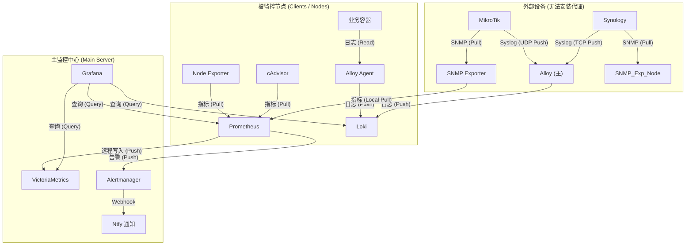

# 指标与日志监控的搭建指南

## 全局思路

这套监控系统采用了目前云原生领域最经典的 **“Metrics Pull (指标拉取) + Logs Push (日志推送)”** 混合架构。

为了方便理解，我们将系统分为 **“主监控中心 (Server)”** 和 **“被监控节点 (Clients)”** 两部分。

> 📌 **环境 IP 示例说明（请在实操时替换为您的实际 IP）：**
> *   主监控服务器：`192.168.60.32`
> *   示例被监控节点 (PVE/LXC/VM)：`192.168.60.10`, `192.168.60.18` 等
> *   示例路由器 / NAS：`192.168.60.1` / `192.168.60.30`
> *   监控服务域名示例：`*.example.com`

---

## 一、 核心架构与数据流向图



## 二、 详细组件解析与数据流

### 1. 指标 (Metrics) —— "拉 (Pull) 模式"
**核心逻辑:** 监控服务器主动去问客户端：“你现在状态如何？”

*   **数据源头 (Exporters)**:
    *   **Node Exporter**: 安装在所有 Linux 节点 (PVE, VM, 树莓派等)。暴露 OS 层面指标 (CPU、内存、磁盘 IO、网络流量)。
    *   **cAdvisor**: 安装在 Docker 主机。暴露容器层面的指标 (每个容器的 CPU/RAM 使用率)。
    *   **SNMP Exporter**: 作为一个“翻译官”。Prometheus 问它，它去问路由器/NAS (通过 SNMP 协议)，然后把结果翻译成 Prometheus 格式返回。
    *   **Blackbox Exporter**: 作为一个“探测器”。Prometheus 命令它：“去 Ping 一下 Google”，它执行后把网络延迟、连通性等结果返回。

*   **数据采集 (Prometheus)**:
    *   根据配置文件 (`prometheus.yml`) 中的 `scrape_interval`，定期 (如 15s) 请求所有 Exporter 的 HTTP 接口。
    *   **数据流向:** Prometheus (主) $\to$ 发起 TCP 连接 $\to$ Exporters (客户端)。

*   **长期存储 (VictoriaMetrics)**:
    *   Prometheus 本地只存短期的热数据。
    *   通过 `remote_write` 配置，Prometheus 将采集到的数据**实时推送到** VictoriaMetrics。
    *   **用途:** VictoriaMetrics 负责存储长达 30 天甚至几年的历史数据，性能更好且节省空间。

### 2. 日志 (Logs) —— "推 (Push) 模式"
**核心逻辑:** 客户端产生日志后，主动打包发送给监控服务器。

*   **采集端 (Alloy Agents)**:
    *   安装在各个节点上 (或主服务器自身)。
    *   **工作方式:** 它们“盯”着本地的文件 (`/var/log/syslog`) 或 Docker 管道。一旦有新日志，立刻清洗并打包。
    *   **数据流向:** Alloy (客户端) $\to$ 发起 HTTP/TCP 连接 $\to$ Loki (主服务器)。

*   **特殊日志源 (Syslog)**:
    *   MikroTik 和 Synology 无法安装 Alloy Agent。它们使用标准的 Syslog 协议，将日志推送到主服务器 Alloy 监听的指定端口 (UDP 15141 / TCP 15140)。

*   **存储端 (Loki)**:
    *   接收所有来源的日志，建立索引 (仅索引 Label，不索引全文以节省资源)，并存入磁盘。

### 3. 告警 (Alerting)
*   **Prometheus**: 根据规则文件 (`rules.yml`) 计算。例如：`if up == 0 for 10m`。如果满足条件，生成一条“警报”。
*   **Alertmanager**: 接收 Prometheus 发来的警报。负责：
    *   **去重**: 如果多个节点同时宕机，合并告警，避免轰炸。
    *   **分组**: 把同一台机器的 CPU、内存告警合并为一条。
    *   **路由**: 发送给 Ntfy、邮件或钉钉等接收端。

---

## 三、 运维指导手册

### 1. 防火墙与网络策略 (Firewall Rules)
这是系统扩容和排查网络不通时的**“金科玉律”**。

| 源地址 (Source) | 目标地址 (Destination) | 端口 (Port) | 协议 | 用途 | 备注 |
| :--- | :--- | :--- | :--- | :--- | :--- |
| **主监控服务器 IP** | **所有客户端 IP** | **9100** | TCP | 抓取主机指标 | 必须放行 |
| **主监控服务器 IP** | **所有 Docker 主机** | **8080** | TCP | 抓取容器指标 | cAdvisor 端口 |
| **主监控服务器 IP** | **SNMP Exporter** | **9116** | TCP | 抓取 SNMP 转换指标 | 通常走 Docker 内部网络 |
| **主监控服务器 IP** | **Blackbox Exporter** | **9115** | TCP | 抓取探测结果 | Docker 内部网络 |
| **所有客户端 IP** | **主监控服务器 IP** | **3100** | TCP | Alloy 推送日志 | **日志接收关键端口** |
| **路由器 (MikroTik)**| **主监控服务器 IP** | **15141** | **UDP** | 发送 Syslog | 注意是 UDP |
| **NAS (Synology)** | **主监控服务器 IP** | **15140** | TCP | 发送 Syslog | TCP 协议 |
| **管理员 PC / 反代**| **主监控服务器 IP** | **3000** | TCP | 访问 Grafana 面板 | |

**重点总结:**
*   **主服务器**需要能 **OUT (出站)** 连接所有客户端的 **9100/8080**。
*   **客户端**需要能 **IN (入站)** 连接主服务器的 **3100**。

### 2. 将来扩容：如何添加一台新机器？
假设要监控一台新的 Ubuntu 虚拟机 `192.168.60.50`：

1.  **被动端 (Metrics):** 使用 Docker 或二进制安装 `node-exporter`，暴露 9100 端口。防火墙允许主监控服务器 IP 访问本机的 9100。
2.  **主动端 (Prometheus):** 在主服务器编辑 `prometheus.yml`，在对应 job 下添加 target `['192.168.60.50:9100']`。重载 Prometheus (`curl -X POST http://localhost:9090/-/reload`)。
3.  **日志端 (Alloy):** 在新机器安装 Alloy Agent。配置 `loki.write` 指向 `http://<主服务器IP>:3100/loki/api/v1/push`。启动 Alloy。

### 3. 故障排查思路
*   **现象：Grafana 里某台机器没数据了 (No Data)。**
    1.  打开 Prometheus Web UI (`http://<主IP>:9090/targets`)。
    2.  如果是 **DOWN**，看报错原因：
        *   `Connection refused` $\to$ 目标机器没运行 Exporter 或服务挂了。
        *   `Context deadline exceeded` $\to$ 网络不通或防火墙拦截。
    3.  登录目标机器，执行 `curl localhost:9100/metrics` 测试本地是否有数据。
*   **现象：Loki 里搜不到某台机器的日志。**
    1.  检查客户端 Alloy 容器日志。如果有 `connection refused` 或 `timeout`，说明客户端连不上主服务器的 3100 端口。
    2.  **检查时间**：确保客户端和服务器时间同步。时差过大可能导致 Loki 丢弃日志。
*   **现象：告警没收到。**
    1.  去 Prometheus Alerts 页看告警是否处于 `Firing` 状态。
    2.  去 Alertmanager 页看是否成功路由。
    3.  检查 Ntfy/Webhook 日志测试连通性。

---

# 服务端 - 监控主服务器实操

## 一、配置指标与日志组件

### 1. Alertmanager 配置
```bash
sudo mkdir -p /opt/monitoring-stack/alertmanager/{config,data}
sudo nano /opt/monitoring-stack/alertmanager/config/alertmanager.yml
```
**内容:**
```yaml
global:
  resolve_timeout: 5m

route:
  group_by: ['alertname', 'job', 'severity']
  group_wait: 30s
  group_interval: 5m
  repeat_interval: 1h
  receiver: 'ntfy-notifications'

receivers:
- name: 'ntfy-notifications'
  webhook_configs:
  - url: 'https://ntfy.example.com/prometheus' # 替换为你的 ntfy 地址
    send_resolved: true
```

### 2. Prometheus 配置
```bash
sudo mkdir -p /opt/monitoring-stack/prometheus
sudo nano /opt/monitoring-stack/prometheus/prometheus.yml
```
**内容:**
```yaml
global:
  scrape_interval: 15s
  evaluation_interval: 15s
  scrape_timeout: 10s

alerting:
  alertmanagers:
  - static_configs:
    - targets:
      - 'alertmanager:9093'

rule_files:
  - "/etc/prometheus/rules/host-and-service-alerts.rules.yml"

scrape_configs:
  # --- 本机与节点系统指标 ---
  - job_name: 'prometheus'
    static_configs: [{'targets': ['localhost:9090']}]

  - job_name: 'vm-192-168-60-32-homelab1'
    static_configs: [{'targets': ['192.168.60.32:9100']}]

  - job_name: 'pve1'
    static_configs: [{'targets': ['192.168.60.10:9100']}]
    
  - job_name: 'openwrt-node-192-168-60-2'
    scrape_interval: 60s
    scrape_timeout: 45s
    static_configs: [{'targets': ['192.168.60.2:9100']}]

  # --- SNMP 监控 ---
  - job_name: 'synology-nas-snmp'
    scrape_interval: 60s
    scrape_timeout: 45s
    static_configs:
      - targets: ['192.168.60.30']
    metrics_path: /snmp
    params:
      auth: [synology]
      module: ['if_mib', 'synology']
    relabel_configs:
      - source_labels: [__address__]
        target_label: __param_target
      - source_labels: [__param_target]
        target_label: instance
      - target_label: __address__
        replacement: 'synology-snmp-exporter:9116'

  - job_name: 'mikrotik-snmp'
    scrape_interval: 60s
    scrape_timeout: 30s
    static_configs:
      - targets: ['192.168.60.1']
    metrics_path: /snmp
    params:
      module: [mikrotik]
    relabel_configs:
      - source_labels: [__address__]
        target_label: __param_target
      - source_labels: [__param_target]
        target_label: instance
      - target_label: __address__
        replacement: mikrotik-snmp-exporter:9116

  # --- 容器指标 (cAdvisor) ---
  - job_name: 'vms-lab1-192-168-60-32-homelab1-container'
    scrape_interval: 30s
    scrape_timeout: 25s
    static_configs:
      - targets: ['cadvisor:8080']
        labels:
          instance: '192-168-60-32-homelab1-containers'

  - job_name: 'vms-pve1-192-168-60-10-pve1-container'
    static_configs:
      - targets: ['192.168.60.10:8080']
        labels:
          instance: '192-168-60-10-pve1-containers'

  # --- 网络探测 (Blackbox) ---
  - job_name: 'blackbox_wan_http'
    scrape_interval: 30s
    scrape_timeout: 20s
    metrics_path: /probe
    params:
      module: [http_2xx]
    static_configs:
      - targets:
        - https://www.google.com
        - https://status.docker.com
        - https://www.baidu.com
    relabel_configs:
      - source_labels: [__address__]
        target_label: __param_target
      - source_labels: [__param_target]
        target_label: instance
      - target_label: __address__
        replacement: blackbox_exporter:9115

  - job_name: 'blackbox_wan_icmp'
    scrape_interval: 60s
    metrics_path: /probe
    params:
      module: [icmp]
    static_configs:
      - targets:
        - 8.8.8.8
        - 1.1.1.1
        - 223.5.5.5
    relabel_configs:
      - source_labels: [__address__]
        target_label: __param_target
      - source_labels: [__param_target]
        target_label: instance
      - target_label: __address__
        replacement: blackbox_exporter:9115

remote_write:
  - url: "http://vmstorage:8428/api/v1/write"
```

配置修改后重载：
```bash
curl -X POST http://localhost:9090/-/reload
```

### 3. Prometheus 告警规则
```bash
sudo mkdir -p /opt/monitoring-stack/prometheus/rules
sudo nano /opt/monitoring-stack/prometheus/rules/host-and-service-alerts.rules.yml
```

```yaml
groups:
- name: HostAndServiceAlerts
  rules:
  # ------------------------------------------------------------------------------------
  # 主机和实例可用性告警 (Instance/Exporter Availability)
  # ------------------------------------------------------------------------------------
  - alert: InstanceDown
    expr: up == 0
    for: 10m # 目标离线超过10分钟才告警,以减少因短暂重启或网络波动造成的噪音
    labels:
      severity: critical # 严重等级
      category: availability
    annotations:
      summary: "实例 {{ $labels.instance }} (任务 {{ $labels.job }}) 已离线"
      description: "实例 {{ $labels.instance }} (任务 {{ $labels.job }}) 已经离线超过 10 分钟。"
      value: "{{ $value }}" # 当前 up 的值 (0)
      job: "{{ $labels.job }}"
      instance: "{{ $labels.instance }}"

  # ------------------------------------------------------------------------------------
  # 主机资源告警 (Host Resource Alerts) - 基于 Node Exporter 指标
  # 确保 Node Exporter 正在运行并且 Prometheus 正在抓取它
  # ------------------------------------------------------------------------------------

  # --- CPU 相关 ---
  - alert: HostHighCpuUsage
    expr: (100 - (avg by (instance) (rate(node_cpu_seconds_total{mode="idle"}[2m])) * 100)) > 85 # CPU使用率超过85% (基于2分钟内的平均空闲率计算)
    for: 10m # 持续10分钟
    labels:
      severity: warning
      category: host_resources
    annotations:
      summary: "主机 {{ $labels.instance }} CPU 使用率过高"
      description: "主机 {{ $labels.instance }} (任务 {{ $labels.job }}) 的 CPU 使用率持续 10 分钟超过 85%。当前值: {{ $value | printf \"%.2f\" }}%"
      job: "{{ $labels.job }}"
      instance: "{{ $labels.instance }}"
      current_value: "{{ $value | printf \"%.2f\" }}%"

  - alert: HostHighCpuLoad
    # 1分钟负载除以CPU核心数,如果大于1.5,表示每个核心都在处理超过1.5个进程的等待队列。
    # 您可能需要根据实际CPU核心数和可接受的负载来调整阈值。
    # (count without (cpu, mode) (node_cpu_seconds_total{mode="system"})) 用于获取CPU核心数
    # 此规则假设所有被监控的 node exporter 实例的 job 名称中包含 "node"
    expr: avg by (instance) (rate(node_load1{job=~".*node.*"}[5m])) / count by (instance) (node_cpu_seconds_total{mode="idle",job=~".*node.*"}) > 1.5
    for: 15m # 15分钟负载持续较高
    labels:
      severity: warning
      category: host_resources
    annotations:
      summary: "主机 {{ $labels.instance }} CPU 负载过高"
      description: "主机 {{ $labels.instance }} (任务 {{ $labels.job }}) 的平均CPU负载(每核心)持续15分钟超过1.5。当前值: {{ $value | printf \"%.2f\" }}"
      job: "{{ $labels.job }}"
      instance: "{{ $labels.instance }}"
      current_value: "{{ $value | printf \"%.2f\" }}"

  # --- 内存相关 ---
  - alert: HostHighMemoryUsage
    # 实际使用内存 = 总内存 - (空闲内存 + Buffers + Cached)
    # 内存使用率 = 实际使用内存 / 总内存 * 100
    expr: (node_memory_MemTotal_bytes - (node_memory_MemFree_bytes + node_memory_Buffers_bytes + node_memory_Cached_bytes{job=~".*node.*"})) / node_memory_MemTotal_bytes{job=~".*node.*"} * 100 > 85
    for: 10m
    labels:
      severity: warning # 根据实际情况可能是 critical
      category: host_resources
    annotations:
      summary: "主机 {{ $labels.instance }} 内存使用率过高"
      description: "主机 {{ $labels.instance }} (任务 {{ $labels.job }}) 的内存使用率持续 10 分钟超过 85%。当前值: {{ $value | printf \"%.2f\" }}%"
      job: "{{ $labels.job }}"
      instance: "{{ $labels.instance }}"
      current_value: "{{ $value | printf \"%.2f\" }}%"

  - alert: HostLowAvailableMemory
    # 直接监控可用内存 (MemAvailable_bytes),通常比计算的更准确反映系统实际可用内存
    expr: node_memory_MemAvailable_bytes{job=~".*node.*"} / node_memory_MemTotal_bytes{job=~".*node.*"} * 100 < 10
    for: 15m # 可用内存持续15分钟低于10%
    labels:
      severity: critical
      category: host_resources
    annotations:
      summary: "主机 {{ $labels.instance }} 可用内存不足"
      description: "主机 {{ $labels.instance }} (任务 {{ $labels.job }}) 的可用内存持续15分钟低于 10%。当前可用: {{ $value | printf \"%.2f\" }}%"
      job: "{{ $labels.job }}"
      instance: "{{ $labels.instance }}"
      current_value: "{{ $value | printf \"%.2f\" }}%"

  # --- 磁盘空间相关 ---
  - alert: HostLowDiskSpace
    # 排除 tmpfs 和 squashfs 等特殊文件系统,只关注实际的挂载点
    # 可用空间低于15%
    expr: node_filesystem_avail_bytes{mountpoint!="",fstype!~"tmpfs|squashfs|iso9660|overlay|autofs|udf|vfat",job=~".*node.*"} / node_filesystem_size_bytes{mountpoint!="",fstype!~"tmpfs|squashfs|iso9660|overlay|autofs|udf|vfat",job=~".*node.*"} * 100 < 15
    for: 5m
    labels:
      severity: warning # 先警告,如果低于更小值则 critical
      category: host_resources
    annotations:
      summary: "主机 {{ $labels.instance }} 磁盘空间不足 ({{ $labels.mountpoint }})"
      description: "主机 {{ $labels.instance }} 的挂载点 {{ $labels.mountpoint }} (设备 {{ $labels.device }}, 文件系统 {{ $labels.fstype }}, 任务 {{ $labels.job }}) 的可用磁盘空间低于 15%。当前可用: {{ $value | printf \"%.2f\" }}%"
      job: "{{ $labels.job }}"
      instance: "{{ $labels.instance }}"
      mountpoint: "{{ $labels.mountpoint }}"
      current_value: "{{ $value | printf \"%.2f\" }}%"

  - alert: HostVeryLowDiskSpace
    expr: node_filesystem_avail_bytes{mountpoint!="",fstype!~"tmpfs|squashfs|iso9660|overlay|autofs|udf|vfat",job=~".*node.*"} / node_filesystem_size_bytes{mountpoint!="",fstype!~"tmpfs|squashfs|iso9660|overlay|autofs|udf|vfat",job=~".*node.*"} * 100 < 5
    for: 5m
    labels:
      severity: critical
      category: host_resources
    annotations:
      summary: "主机 {{ $labels.instance }} 磁盘空间严重不足 ({{ $labels.mountpoint }})"
      description: "主机 {{ $labels.instance }} 的挂载点 {{ $labels.mountpoint }} (设备 {{ $labels.device }}, 文件系统 {{ $labels.fstype }}, 任务 {{ $labels.job }}) 的可用磁盘空间低于 5%。当前可用: {{ $value | printf \"%.2f\" }}%"
      job: "{{ $labels.job }}"
      instance: "{{ $labels.instance }}"
      mountpoint: "{{ $labels.mountpoint }}"
      current_value: "{{ $value | printf \"%.2f\" }}%"

  - alert: HostDiskWillFillIn4Hours # 预测性告警
    # 基于过去1小时的数据增长率,预测磁盘是否会在4小时内耗尽
    expr: predict_linear(node_filesystem_free_bytes{mountpoint!="",fstype!~"tmpfs|squashfs|iso9660|overlay|autofs|udf|vfat",job=~".*node.*"}[1h], 4 * 3600) < 0
    for: 30m # 预测持续30分钟有效才告警
    labels:
      severity: critical
      category: host_resources
    annotations:
      summary: "主机 {{ $labels.instance }} 磁盘空间预计在4小时内耗尽 ({{ $labels.mountpoint }})"
      description: "主机 {{ $labels.instance }} 的挂载点 {{ $labels.mountpoint }} (设备 {{ $labels.device }}, 文件系统 {{ $labels.fstype }}, 任务 {{ $labels.job }}) 根据过去1小时的使用趋势,预计将在4小时内耗尽空间。"
      job: "{{ $labels.job }}"
      instance: "{{ $labels.instance }}"
      mountpoint: "{{ $labels.mountpoint }}"

  # --- 磁盘 I/O 相关 (这些规则可能需要根据您的磁盘类型和基线进行大量调整) ---
  - alert: HostHighDiskIoReadLatency
    # 这是一个示例,实际指标名和阈值可能因您的 Node Exporter 版本和磁盘类型而异
    # 通常使用 node_disk_read_time_seconds_total 和 node_disk_reads_completed_total 来计算平均延迟
    # (rate(node_disk_read_time_seconds_total[1m]) / rate(node_disk_reads_completed_total[1m])) > 0.1 表示平均读延迟大于100ms
    # 需要排除没有I/O活动的设备以避免除零错误 (rate(...) > 0)
    expr: histogram_quantile(0.95, sum(rate(node_disk_io_time_weighted_seconds_total{job=~".*node.*", device=~"sd.*|nvme.*|vd.*"}[1m])) by (le, instance, device)) / 1000 > 100 # 95分位I/O时间超过100ms
    for: 5m
    labels:
      severity: warning
      category: host_resources
    annotations:
      summary: "主机 {{ $labels.instance }} 磁盘 {{ $labels.device }} 读取延迟过高"
      description: "主机 {{ $labels.instance }} 的磁盘 {{ $labels.device }} (任务 {{ $labels.job }}) 的95分位读取延迟持续5分钟超过 100ms。当前值: {{ $value | printf \"%.2f\" }}ms"
      job: "{{ $labels.job }}"
      instance: "{{ $labels.instance }}"
      device: "{{ $labels.device }}"
      current_value: "{{ $value | printf \"%.2f\" }}ms"

  # ------------------------------------------------------------------------------------
  # Prometheus 自身监控告警 (Meta-Monitoring)
  # ------------------------------------------------------------------------------------
  - alert: PrometheusTargetScrapesFailed
    # 计算5分钟内失败的scrape次数,如果大于0
    expr: increase(prometheus_target_scrapes_sample_failed_total[5m]) > 0
    for: 5m
    labels:
      severity: warning
      category: prometheus
    annotations:
      summary: "Prometheus 抓取目标失败次数增加"
      description: "Prometheus 在过去5分钟内抓取目标失败的次数有所增加。当前失败次数: {{ $value }}"
      value: "{{ $value }}"

  - alert: PrometheusRuleEvaluationFailures
    expr: increase(prometheus_rule_evaluation_failures_total[5m]) > 0
    for: 1m # 规则评估失败应该立即引起注意
    labels:
      severity: critical
      category: prometheus
    annotations:
      summary: "Prometheus 规则评估失败"
      description: "Prometheus 在过去5分钟内规则评估失败的次数有所增加。当前失败次数: {{ $value }}"
      value: "{{ $value }}"

  - alert: PrometheusNotificationsDropped
    # Alertmanager通知队列溢出或发送失败
    expr: increase(prometheus_notifications_dropped_total[5m]) > 0
    for: 1m
    labels:
      severity: critical
      category: prometheus
    annotations:
      summary: "Prometheus 丢弃了发往 Alertmanager 的告警"
      description: "Prometheus 在过去5分钟内丢弃了 {{ $value }} 条发往 Alertmanager 的告警通知,可能是因为 Alertmanager 队列已满或配置错误。"
      value: "{{ $value }}"

  # ------------------------------------------------------------------------------------
  # Alertmanager 自身监控告警
  # ------------------------------------------------------------------------------------
  - alert: AlertmanagerConfigNotLoaded
    # 检查Alertmanager的配置是否成功加载。通常alertmanager自身暴露此指标。
    # 如果您的Alertmanager没有这个指标,需要查阅其文档或寻找替代指标。
    expr: alertmanager_config_last_reload_successful == 0
    for: 5m
    labels:
      severity: critical
      category: alertmanager
    annotations:
      summary: "Alertmanager {{ $labels.instance }} 配置加载失败"
      description: "Alertmanager 实例 {{ $labels.instance }} (任务 {{ $labels.job }}) 的最新配置加载失败。"
      job: "{{ $labels.job }}"
      instance: "{{ $labels.instance }}"

  - alert: AlertmanagerNotificationsFailed
    # 检查特定集成(如webhook, email)的通知失败率
    # 标签 'integration' 会告诉你哪个通知方式出问题了
    expr: rate(alertmanager_notifications_failed_total[5m]) > 0
    for: 5m
    labels:
      severity: warning
      category: alertmanager
    annotations:
      summary: "Alertmanager {{ $labels.instance }} 通知发送失败 (集成: {{ $labels.integration }})"
      description: "Alertmanager 实例 {{ $labels.instance }} (任务 {{ $labels.job }}) 向集成 {{ $labels.integration }} 发送通知的失败率正在增加。当前失败率: {{ $value | printf \"%.2f\" }}/s"
      job: "{{ $labels.job }}"
      instance: "{{ $labels.instance }}"
      integration: "{{ $labels.integration }}"
      current_value: "{{ $value | printf \"%.2f\" }}/s"

  # 您可以根据需要添加更多针对特定应用或服务的告警规则
  # 例如:Nginx Exporter, AdGuard Home Exporter, VictoriaMetrics 自身指标等
```


### 4. Loki 配置
```bash
sudo mkdir -p /opt/monitoring-stack/loki
sudo nano /opt/monitoring-stack/loki/loki-config.yaml
```

```yaml
auth_enabled: false

server:
  http_listen_port: 3100
  grpc_listen_port: 9096
  log_level: info
  grpc_server_max_concurrent_streams: 1000

common:
  instance_addr: 127.0.0.1
  path_prefix: /loki # 确保与 Docker Volume 挂载一致 (loki_data:/loki)
  storage:
    filesystem:
      chunks_directory: /loki/chunks # 会基于 path_prefix
      rules_directory: /loki/rules   # 会基于 path_prefix
  replication_factor: 1
  ring:
    kvstore:
      store: inmemory

query_range: # 用于结果缓存
  results_cache:
    cache:
      embedded_cache:
        enabled: true
        max_size_mb: 100

limits_config:
  metric_aggregation_enabled: true # 如果你不需要指标聚合,可以考虑设为 false 或注释掉
  allow_structured_metadata: false # 禁用结构化元数据处理,结构化元数据处理总是抛弃alloy发来的日志
  # 如果接收旧日志就把下面两行的注释取消
  # reject_old_samples: true
  # reject_old_samples_max_age: 720h
  # 允许接收未来 24 小时内的日志,解决时区问题
  creation_grace_period: 24h

schema_config:
  configs:
    - from: 2025-01-01 # 你的自定义起始日期
      store: tsdb
      object_store: filesystem
      schema: v13
      index:
        prefix: index_
        period: 24h # 你可以根据需求调整,例如 168h (7天)

ingester: # 你手动添加的核心 ingester 配置
  lifecycler:
    address: 127.0.0.1
    ring:
      kvstore:
        store: inmemory
      replication_factor: 1
    final_sleep: 0s
  wal:
    enabled: true
    dir: /loki/wal # 确保在 /loki 持久卷下

compactor: # 你手动添加的 compactor 配置
  working_directory: /loki/compactor_temp # 确保在 /loki 持久卷下
  compaction_interval: 10m
  retention_enabled: true
  retention_delete_delay: 2h
  delete_request_store: filesystem

table_manager: # 你手动添加的 table_manager 配置
  retention_deletes_enabled: true
  retention_period: 720h # 30天保留,根据你的需求调整

# --- 以下是官方 v3.4.1 loki-local-config.yaml 中其他一些默认存在的块 ---
# --- 如果你确定不需要它们,或者它们与你的设置有冲突,可以调整或移除 ---

distributor: # 官方默认配置中有这个
  ring:
    kvstore:
      store: inmemory

querier: # 官方默认配置中有这个
  # Default is 0, meaning unlimited. Let's keep it commented to use default unless needed.
  # max_concurrent: 10

frontend: # 官方默认配置中有这个,用于gRPC
  encoding: protobuf
  # 如果需要更细致的 query_frontend 功能(如我们之前讨论的独立 query_frontend 块),
  # 并且确认不会与这个 frontend 块冲突,可以考虑在这里添加,但这需要非常谨慎。
  # 目前,依赖 query_range.results_cache 实现结果缓存。

pattern_ingester: # 官方默认配置中有这个
  enabled: false # 完全禁用 pattern_ingester。仍然试图使用或假定日志流中存在结构化元数据,而这个特性已经被您显式禁用了,导致了新的拒绝。
  metric_aggregation:
    loki_address: localhost:3100 # 或者 loki:3100

ruler: # 官方默认配置中有这个
  alertmanager_url: http://alertmanager:9093
  # storage, rule_path, ring, enable_api 等其他 ruler 配置参考官方默认

# By default, Loki will send anonymous, but uniquely-identifiable usage and configuration
# analytics to Grafana Labs. These statistics are sent to https://stats.grafana.org/
#
# Statistics help us better understand how Loki is used, and they show us performance
# levels for most users. This helps us prioritize features and documentation.
# For more information on what's sent, look at
# https://github.com/grafana/loki/blob/main/pkg/analytics/stats.go
# Refer to the buildReport method to see what goes into a report.
#
# If you would like to disable reporting, uncomment the following lines:
#analytics:
#  reporting_enabled: false
```

### 5. Alloy (主监控服务器) 配置
负责收集本机日志，并作为中继接收外部网络设备的 Syslog。
```bash
sudo mkdir -p /opt/monitoring-stack/alloy
sudo nano /opt/monitoring-stack/alloy/config.alloy
```
```alloy
// /opt/monitoring-stack/alloy/config.alloy

logging {
  level  = "info"
  format = "logfmt"
}

// =======================================================
// 1. 输出端:写入本地 Docker 网络中的 Loki
// =======================================================
loki.write "local_loki_output" {
  endpoint {
    url = "http://loki:3100/loki/api/v1/push"
  }
}

// =======================================================
// 2. 本机日志 (Self-Monitoring)
// =======================================================

// 2.A Systemd Journal (宿主机)
loki.source.journal "main_journal" {
  max_age        = "24h"
  // 【修复】Key 去掉引号,尾部加上逗号
  labels         = { 
    instance = env("HOSTNAME_VAR"), 
    job      = "system_journal",
  }
  forward_to     = [loki.relabel.journal_cleanup.receiver]
}

loki.relabel "journal_cleanup" {
  forward_to = [loki.write.local_loki_output.receiver]
  rule {
    source_labels = ["__journal__systemd_unit"]
    target_label  = "unit"
  }
  rule {
    source_labels = ["__journal_priority_keyword"]
    target_label  = "priority"
  }
}

// 2.B 系统文件日志 (/var/log/syslog 等)
local.file_match "main_syslogs" {
  path_targets = [
    { __path__ = "/var/log_host/syslog",     instance = env("HOSTNAME_VAR"), job = "system_files" },
    { __path__ = "/var/log_host/auth.log",   instance = env("HOSTNAME_VAR"), job = "system_files" },
    { __path__ = "/var/log_host/daemon.log", instance = env("HOSTNAME_VAR"), job = "system_files" },
    { __path__ = "/var/log_host/kern.log",   instance = env("HOSTNAME_VAR"), job = "system_files" },
  ]
}
loki.source.file "read_main_syslogs" {
  targets    = local.file_match.main_syslogs.targets
  forward_to = [loki.write.local_loki_output.receiver]
}

// 2.C Docker 容器日志
discovery.docker "main_docker" {
  host = "unix:///var/run/docker.sock"
}

loki.source.docker "read_main_docker" {
  host       = "unix:///var/run/docker.sock"
  targets    = discovery.docker.main_docker.targets
  // 统一标签:instance=主机名, job=docker_containers【修复】Key 去掉引号
  labels     = { 
    instance = env("HOSTNAME_VAR"),
    job      = "docker_containers",
  }
  forward_to = [loki.relabel.docker_process.receiver]
}

loki.relabel "docker_process" {
  forward_to = [loki.write.local_loki_output.receiver]

  // 提取容器名为 container 标签
  rule {
    source_labels = ["__meta_docker_container_name"]
    regex         = "/(.*)"
    target_label  = "container"
  }
  // 提取镜像名
  rule {
    source_labels = ["__meta_docker_container_image_name"]
    target_label  = "image"
  }
  // 清理 Docker 元数据标签
  rule {
    action = "labeldrop"
    regex  = "__meta_docker_.+"
  }
}

// =======================================================
// 3. 外部日志接收:Synology NAS (TCP Syslog)
// =======================================================
loki.source.syslog "synology_listener" {
  listener {
    address       = "0.0.0.0:15140"
    protocol      = "tcp"
    
    // 默认标签 (兜底用)
    labels        = { 
      job         = "synology_nas", 
      device_type = "nas",
      instance    = "synology_unknown", 
    }
  }
  forward_to = [loki.relabel.synology_process.receiver]
}

loki.relabel "synology_process" {
  forward_to = [loki.write.local_loki_output.receiver]

  // 【关键修改】合并双 IP 逻辑
  // 无论日志是从 .30 来的,还是 .31 来的,都统一归类
  rule {
    source_labels = ["__syslog_connection_address"]
    // 正则解释:匹配包含 192.168.60.30 或者 192.168.60.31 的地址
    regex         = ".*192\\.168\\.60\\.(30|31).*" 
    target_label  = "instance"
    // 统一重命名为 .30 (主IP) 或者 "Synology_NAS",这样在 Grafana 里只显示这一个条目
    replacement   = "192.168.60.30" 
  }

  // (可选) 如果你想保留原始来源IP以便排查网络路径,可以加这一条
  rule {
    source_labels = ["__syslog_connection_address"]
    regex         = "^(.*?):.*$"
    target_label  = "source_ip"
  }

  // 保留 Hostname 提取
  rule {
    source_labels = ["__syslog_message_hostname"]
    target_label  = "hostname"
  }
}

// =======================================================
// 4. 外部日志接收:Mikrotik Router (OTEL UDP)
// =======================================================
// 4.1 使用 OTEL 接收 Syslog (RFC3164 兼容性最好)
otelcol.receiver.syslog "mikrotik_otel_in" {
  udp {
    listen_address = "0.0.0.0:15141"
  }
  protocol = "rfc3164"
  output {
    logs = [otelcol.exporter.loki.mikrotik_otel_out.input]
  }
}

// 4.2 转发给 Relabel 处理器
otelcol.exporter.loki "mikrotik_otel_out" {
  forward_to = [loki.relabel.mikrotik_process.receiver]
}

// 4.3 清洗标签,确保统一
loki.relabel "mikrotik_process" {
  forward_to = [loki.write.local_loki_output.receiver]

  // 强制设置 instance 和 job
  rule {
    target_label = "instance"
    replacement  = "192.168.60.1" // 你的Mikrotik 路由器 IP
  }
  rule {
    target_label = "job"
    replacement  = "mikrotik_router"
  }
  
  // 清理 OTEL 自动生成的杂乱标签
  rule {
    action = "labeldrop"
    regex  = "^(exporter|service_name|level|severity_.*|facility_.*)$"
  }
}
```

### 6. Blackbox Exporter 配置
```bash
sudo mkdir -p /opt/monitoring-stack/blackbox
sudo nano /opt/monitoring-stack/blackbox/blackbox.yml
```
**内容:**
```yaml
modules:
  http_2xx:
    prober: http
    timeout: 10s
    http:
      valid_status_codes: []
      method: GET
      preferred_ip_protocol: "ip4"

  https_2xx:
    prober: http
    timeout: 10s
    http:
      valid_http_versions: ["HTTP/1.1", "HTTP/2.0"]
      tls_config:
        insecure_skip_verify: false

  tcp_connect:
    prober: tcp
    timeout: 10s

  icmp:
    prober: icmp
    timeout: 10s
    icmp:
      preferred_ip_protocol: "ip4"
```

### 7. 权限修正
确保 Docker 挂载的目录拥有正确的用户权限，防止容器启动失败（如 Permission Denied）：
```bash
cd /opt/monitoring-stack
sudo chown -R 10001:10001 ./loki
sudo chown -R 10001:10001 ./alloy
sudo chown -R 65534:65534 ./prometheus
sudo chown -R 65534:65534 ./alertmanager
sudo chown -R 65534:65534 ./blackbox
sudo chown -R 65534:65534 ./synology-snmp-exporter
```

### 8. 针对 Synology nas 的 snmp_exporter 配置

```bash
sudo mkdir -p /opt/monitoring-stack/synology-snmp-exporter && sudo nano /opt/monitoring-stack/synology-snmp-exporter/snmp.yml
```

snmp.yml 的制作过程见其他文章

### 9. 主服务 Docker Compose 编排
创建 `.env` 环境变量文件：
```bash
sudo nano /opt/monitoring-stack/.env
```
```env
# 镜像
GRAFANA_IMAGE=grafana/grafana:latest
VMSTOEAGE_IMAGE=victoriametrics/victoria-metrics:v1.151.0
LOKI_IMAGE=grafana/loki:3.7.7
PROMETHEUS_IMAGE=prom/prometheus:v3.14.0
ALLOY_IMAGE=grafana/alloy:v1.19.2
ALERTMANAGER_IMAGE=prom/alertmanager:v0.34.0
BLACKBOX_EXPORTER_IMAGE=quay.io/prometheus/blackbox-exporter:latest
SNMP_EXPORTER_IMAGE=prom/snmp-exporter:latest

# 域名配置 (请确保与你的反代配置一致)
GRAFANA_DOMAIN=https://grafana.example.com

# 端口映射
GRAFANA_WEBUI_PORT=3000
VMSTOEAGE_PORT=8428
LOKI_PORT=3100
PROMETHEUS_PORT=9090
ALLOY_PORT=12345
ALLOY_LISTEN_SYNOLOGY_PORT=15140
ALLOY_LISTEN_MIKROTIK_PORT=15141
ALERTMANAGER_PORT=9093
```

创建 Docker 网络并编写 `docker-compose.yml`。

```bash
sudo nano /opt/monitoring-stack/docker-compose.yml
```
内容
```yaml
services:

  # --- 可视化 ---
  grafana:
    image: ${GRAFANA_IMAGE}
    container_name: grafana
    restart: unless-stopped
    volumes:
      - "grafana_storage:/var/lib/grafana"
    environment:
      - GF_SECURITY_ADMIN_PASSWORD=admin
      - GF_SERVER_ROOT_URL=${GRAFANA_DOMAIN}
    logging:
      driver: "json-file"
      options:
        max-size: "10m"
        max-file: "3"
    ports:
      - "${GRAFANA_WEBUI_PORT}:3000"
    depends_on:
      - prometheus
      - loki
      - vmstorage
    networks:
      - monitoring
    deploy:
      resources:
        limits:
          cpus: "0.6"
          memory: "500M"


  # --- 指标长期存储 ---
  vmstorage:
    image: ${VMSTOEAGE_IMAGE}
    container_name: vmstorage
    restart: unless-stopped
    # 如果不手动导入指标数据的话可以删除下面的端口映射,prometheus 可以在通过容器间的通信直接在 http://vmstorage:8428/api/v1/write 写入。
    ports:
      - "${VMSTOEAGE_PORT}:${VMSTOEAGE_PORT}"
    volumes:
      - "vm_data:/victoria-metrics-data"
    command:
      - "-retentionPeriod=30d"
      - "-storageDataPath=/victoria-metrics-data"
      - "-httpListenAddr=:${VMSTOEAGE_PORT}"
    logging:
      driver: "json-file"
      options:
        max-size: "10m"
        max-file: "3"
    networks:
      - monitoring
    deploy:
      resources:
        limits:
          cpus: "1"
          memory: "300M"


  # --- 日志存储 ---
  loki:
    image: ${LOKI_IMAGE}
    container_name: loki
    restart: unless-stopped
    # 此端口为日志接收端口,必须在宿主机防火墙开启它。
    ports:
      - "${LOKI_PORT}:3100"
    volumes:
      - "./loki/loki-config.yaml:/etc/loki/loki-local-config.yaml"
      - "loki_data:/loki"
    command: -config.file=/etc/loki/loki-local-config.yaml
    logging:
      driver: "json-file"
      options:
        max-size: "10m"
        max-file: "3"
    networks:
      - monitoring
    deploy:
      resources:
        limits:
          cpus: "1"
          memory: "300M"


  # --- 指标拉取采集与告警 ---
  prometheus:
    image: ${PROMETHEUS_IMAGE}
    container_name: prometheus
    restart: unless-stopped
    # ports:
      # - "${PROMETHEUS_PORT}:9090"
    volumes:
      - "./prometheus/prometheus.yml:/etc/prometheus/prometheus.yml"
      - "prometheus_data:/prometheus"
      - "./prometheus/rules:/etc/prometheus/rules:ro"
    command:
      - '--config.file=/etc/prometheus/prometheus.yml'
      - '--storage.tsdb.path=/prometheus'
      - '--web.console.libraries=/usr/share/prometheus/console_libraries'
      - '--web.console.templates=/usr/share/prometheus/consoles'
      - '--web.enable-lifecycle'
    logging:
      driver: "json-file"
      options:
        max-size: "10m"
        max-file: "3"
    networks:
      - monitoring
    deploy:
      resources:
        limits:
          cpus: "1"
          memory: "1024M"


  # --- 采集本机日志与接收远程日志 ---
  alloy:
    image: ${ALLOY_IMAGE}
    container_name: alloy
    restart: unless-stopped
    pid: host # 允许 Alloy 访问宿主机的 PID 命名空间 (journal 功能需要)
    environment:
      # 为主监控服务器设置一个明确的主机名
      - HOSTNAME_VAR=monitoring-server # 或者您希望的名称
      # Alloy 的 HTTP 服务端口
      - ALLOY_HTTP_LISTEN_ADDR=0.0.0.0:${ALLOY_PORT} # 与 command 中的 server.http.listen-addr 对应
    volumes:
      # Alloy 配置文件
      - ./alloy/config.alloy:/etc/alloy/config.alloy:ro
      # Alloy 数据持久化目录
      - alloy_data:/var/lib/alloy/data
      # 确保宿主机 Journal 路径映射到容器内标准路径
      - /etc/machine-id:/etc/machine-id:ro
      - /var/run/docker.sock:/var/run/docker.sock
    command:
      - "run"
      - "--storage.path=/var/lib/alloy/data"
      - "--server.http.listen-addr=0.0.0.0:${ALLOY_PORT}" # 确保与环境变量一致或由此参数控制
      - "/etc/alloy/config.alloy"
      # 启用预览版的 OpenTelemetry (OTEL) 组件
      - "--stability.level=public-preview" 
    # 下面2个端口为接收远程 synology nas 与 mikrotik 路由器日志的端口,必须在防火墙开启。
    ports:
      - "${ALLOY_PORT}:${ALLOY_PORT}" # alloy 网页调试界面
      - "${ALLOY_LISTEN_SYNOLOGY_PORT}:${ALLOY_LISTEN_SYNOLOGY_PORT}" # 映射 Synology Syslog 端口 (TCP)
      - "${ALLOY_LISTEN_MIKROTIK_PORT}:${ALLOY_LISTEN_MIKROTIK_PORT}/udp" # 映射 mikrotik-RB750Gr3 Syslog 端口
    logging: # Docker logging driver for Alloy itself
      driver: "json-file"
      options:
        max-size: "10m"
        max-file: "3"
    networks:
      - monitoring
    deploy:
      resources:
        limits:
          cpus: "1"
          memory: "450M"


  # --- 警告发送 ---
  alertmanager:
    image: ${ALERTMANAGER_IMAGE}
    container_name: alertmanager
    restart: unless-stopped
    volumes:
      - ./alertmanager/config:/etc/alertmanager:ro # 配置文件只读挂载
      - ./alertmanager/data:/alertmanager          # 数据持久化
    command:
      - '--config.file=/etc/alertmanager/alertmanager.yml'
      - '--storage.path=/alertmanager'
      - '--web.listen-address=:${ALERTMANAGER_PORT}'
      # 可选: 如果你需要 Alertmanager 知道它的外部 URL (例如用于生成链接)
      # - '--web.external-url=http://192.168.60.32:9093/'
    logging:
      driver: "json-file"
      options:
        max-size: "10m"
        max-file: "3"
    networks:
      - monitoring
    deploy:
      resources:
        limits:
          cpus: "0.5"
          memory: "90M"


  # --- 网络监控 ---
  blackbox_exporter:
    image: ${BLACKBOX_EXPORTER_IMAGE}
    container_name: blackbox_exporter
    command:
      - "--config.file=/config/blackbox.yml"
    volumes:
      - "./blackbox:/config"
    restart: unless-stopped
    logging:
      driver: "json-file"
      options:
        max-size: "10m"
        max-file: "3"
    # 增加这个以允许 ICMP Ping
    cap_add:
      - NET_RAW
    networks:
      - monitoring
    deploy:
      resources:
        limits:
          cpus: "0.5"
          memory: "70M"


  # --- mikrotik 路由器指标中转 ---
  mikrotik-snmp-exporter:
    image: ${SNMP_EXPORTER_IMAGE}
    container_name: mikrotik-snmp-exporter
    logging:
      driver: "json-file"
      options:
        max-size: "10m"
        max-file: "3"
    restart: unless-stopped
    networks:
      - monitoring
    deploy:
      resources:
        limits:
          cpus: "0.5"
          memory: "60M"


  # --- synology nas 指标中转 ---
  synology-snmp-exporter:
    image: ${SNMP_EXPORTER_IMAGE}
    container_name: synology-snmp-exporter
    volumes:
      - ./synology-snmp-exporter/snmp.yml:/etc/snmp_exporter/snmp.yml:ro
    restart: unless-stopped
    command:
      - --config.file=/etc/snmp_exporter/snmp.yml
    logging:
      driver: "json-file"
      options:
        max-size: "10m"
        max-file: "3"
    networks:
      - monitoring
    deploy:
      resources:
        limits:
          cpus: "0.5"
          memory: "70M"

  # --- 容器指标 cadvisor ---
  cadvisor:
    image: ghcr.io/google/cadvisor:latest
    container_name: cadvisor
    privileged: true
    ports:
      - "8080:8080"
    volumes:
      - /:/rootfs:ro
      - /var/run:/var/run:ro
      - /sys:/sys:ro
      - /var/lib/docker/:/var/lib/docker:ro
      - /dev/disk/:/dev/disk:ro
    devices:
      - /dev/kmsg
    restart: unless-stopped
    command:
      # 每 30 秒扫描一次
      - '--housekeeping_interval=30s'
      - '--docker_only=true'
      # Se ha eliminado "accelerator" de la siguiente línea
      - '--disable_metrics=percpu,sched,tcp,udp,hugetlb,referenced_memory,cpu_topology,resctrl,disk,diskIO'
    networks:
      - monitoring
    deploy:
      resources:
        limits:
          cpus: "0.5"
          memory: "512M"

volumes:
  vm_data:
  loki_data:
  alloy_data:
  grafana_storage:
  prometheus_data:

networks:
  monitoring:
```

### 10. 启动服务
```bash
cd /opt/monitoring-stack && sudo docker compose up -d
```

---

## 二、配置 Grafana 面板

1.  **登录:** 访问 `https://grafana.example.com` (默认账号密码均为 `admin`，首次登录请强制修改)。
2.  **添加 VictoriaMetrics 数据源:**
    *   Connections $\to$ Data sources $\to$ Add data source $\to$ 选择 Prometheus。
    *   URL 填写：`http://vmstorage:8428`。
    *   点击 "Save & test"。
3.  **添加 Loki 数据源:**
    *   Connections $\to$ Data sources $\to$ 选择 Loki。
    *   URL 填写：`http://loki:3100`。
    *   点击 "Save & test"。
4.  **导入仪表盘 (Dashboards):**
    *   点击 "+" $\to$ Import dashboard。
    *   推荐输入以下社区官方 ID 快速导入：
        *   `1860`: Node-exporter 主机监控
        *   `19908`: cAdvisor 容器监控
        *   `16292`: Blackbox_exporter 探针监控

---

# 客户端 - 被监控 Linux 实操

## 一、指标收集 (Node Exporter)

```bash
sudo mkdir -p /opt/node-exporter && cd /opt/node-exporter
sudo nano docker-compose.yml
```
**内容 (采用 Host 网络模式):**
```yaml
services:
  node-exporter:
    image: quay.io/prometheus/node-exporter:latest
    container_name: node-exporter
    restart: unless-stopped
    pid: "host"
    network_mode: "host"
    volumes:
      - /proc:/host/proc:ro
      - /sys:/host/sys:ro
      - /:/rootfs:ro
      - type: tmpfs
        target: /tmp
        tmpfs:
          mode: 01777      # 赋予标准 tmp 权限，解决自定义 UID 读写问题
          size: "200M"     # (强烈建议) 限制最大使用内存，防止 OOM
    command:
      - '--path.procfs=/host/proc'
      - '--path.sysfs=/host/sys'
      - '--path.rootfs=/rootfs'
    deploy:
      resources:
        limits:
          cpus: "1"
          memory: "300M"
```
启动后，切记在主监控服务器的 `prometheus.yml` 中添加对应的 IP 抓取任务。

## 二、日志收集 (Alloy Agent)

利用 Alloy 轻量级 Agent 将被监控端的日志推送到主服务器。

1.  **准备配置文件**
```bash
sudo mkdir -p /opt/alloy-agent && sudo nano /opt/alloy-agent/config.alloy
```
内容
```alloy
// /opt/alloy-agent/config.alloy

logging {
  level  = "info"
  format = "logfmt"
}

// =======================================================
// 1. 输出端:写入远程主监控服务器 (注意替换 IP)
// =======================================================
loki.write "remote_loki_output" {
  endpoint {
    // ⚠️ 确保这里是主服务器 IP
    url = "http://192.168.60.32:3100/loki/api/v1/push"
  }
}

// =======================================================
// 1.5 过滤管道: 拦截并丢弃低级别普通文本日志 (File/Docker)
// =======================================================
loki.process "filter_low_level_logs" {
  forward_to = [loki.write.remote_loki_output.receiver]

  // 规则1:Key-Value 格式 (忽略大小写)
  // 匹配: level=info, "level":"debug", lvl: notice 等
  stage.drop {
    expression = "(?i)(\"?(level|lvl)\"?\\s*[:=]\\s*\"?(info|debug|notice|trace)\\b\"?)"
  }

  // 规则2:中括号格式 (忽略大小写)
  // 匹配: [INFO], [debug], 以及常见的单字母简写 [I], [D], [T]
  stage.drop {
    expression = "(?i)(\\[\\s*(info|debug|notice|trace)\\s*\\])|\\[[IDT]\\]"
  }

  // 规则3:独立大写关键词格式 (⚠️严格区分大小写)
  // 匹配: " INFO ", "| INFO |", "INFO:", "=> INFO"
  // 解释: 这里故意不用 (?i),只匹配全大写。这样可以成功丢弃大写的 INFO,但会放过正文里的 "Process info: 3 child processes"
  stage.drop {
    expression = "(\\b(INFO|DEBUG|NOTICE|TRACE)\\b\\s*[:|]|\\s+\\|?\\s*(INFO|DEBUG|NOTICE|TRACE)\\s*\\|?\\s+)"
  }

  // 规则4:数据库/特定中间件的长文本常规日志
  // 匹配: "STATEMENT:", "LOG:" (常用于 PostgreSQL 等数据库过滤)
  stage.drop {
    expression = "\\b(STATEMENT|LOG)\\s*:"
  }
}

// =======================================================
// 2. 日志采集
// =======================================================

// 2.A Systemd Journal (本身自带优先级元数据,直接在 Relabel 阶段拦截最精准)
loki.source.journal "host_journal" {
  max_age        = "24h"
  labels         = { 
    instance = env("HOSTNAME_VAR"), 
    job      = "system_journal",
  }
  forward_to     = [loki.relabel.journal_cleanup.receiver]
}

loki.relabel "journal_cleanup" {
  // 处理完直接发送给输出端 (因为下面已经把 info 丢弃了)
  forward_to = [loki.write.remote_loki_output.receiver]
  
  // 根据系统日志自带的优先级,直接丢弃 info, debug, notice 级别的日志
  rule {
    action        = "drop"
    source_labels = ["__journal_priority_keyword"]
    regex         = "(info|debug|notice)"
  }

  // 提取 unit
  rule {
    source_labels = ["__journal__systemd_unit"]
    target_label  = "unit"
  }
  // 提取优先级
  rule {
    source_labels = ["__journal_priority_keyword"]
    target_label  = "priority"
  }
}

// 2.B 通用系统文件日志
local.file_match "host_syslogs" {
  path_targets = [
    { __path__ = "/var/log_host/syslog",     instance = env("HOSTNAME_VAR"), job = "system_files" },
    { __path__ = "/var/log_host/auth.log",   instance = env("HOSTNAME_VAR"), job = "system_files" },
    { __path__ = "/var/log_host/daemon.log", instance = env("HOSTNAME_VAR"), job = "system_files" },
    { __path__ = "/var/log_host/kern.log",   instance = env("HOSTNAME_VAR"), job = "system_files" },
  ]
}
loki.source.file "read_host_syslogs" {
  targets    = local.file_match.host_syslogs.targets
  // 先发送给 filter 管道过滤,再输出
  forward_to = [loki.process.filter_low_level_logs.receiver]
}

// 2.C PVE 特定日志
local.file_match "pve_logs" {
  path_targets = [
    { __path__ = "/var/log_host/pveproxy/access.log", instance = env("HOSTNAME_VAR"), job = "pve_proxy" },
    { __path__ = "/var/log_host/pveproxy/error.log",  instance = env("HOSTNAME_VAR"), job = "pve_proxy" },
    { __path__ = "/var/log_host/pve/tasks/*/*",      instance = env("HOSTNAME_VAR"), job = "pve_tasks" },
  ]
}
loki.source.file "read_pve_logs" {
  targets    = local.file_match.pve_logs.targets
  // 先发送给 filter 管道过滤,再输出
  forward_to = [loki.process.filter_low_level_logs.receiver]
}

// 2.D Docker 容器日志
discovery.docker "host_docker" {
  host = "unix:///var/run/docker.sock"
}

loki.source.docker "read_host_docker" {
  host       = "unix:///var/run/docker.sock"
  targets    = discovery.docker.host_docker.targets
  labels     = { 
    instance = env("HOSTNAME_VAR"),
    job      = "docker_containers",
  }
  forward_to = [loki.relabel.docker_process.receiver]
}

loki.relabel "docker_process" {
  // 打好容器标签后,发送给 filter 管道过滤,再输出
  forward_to = [loki.process.filter_low_level_logs.receiver]

  rule {
    source_labels = ["__meta_docker_container_name"]
    regex         = "/(.*)"
    target_label  = "container"
  }
  rule {
    source_labels = ["__meta_docker_container_image_name"]
    target_label  = "image"
  }
  rule {
    action = "labeldrop"
    regex  = "__meta_docker_.+"
  }
}
```

2. **准备创建 .env 文件模板**

```bash
sudo nano /opt/alloy-agent/.env.template
```
内容
```env
# /opt/alloy-agent/.env.template
ALLOY_CONTAINER_NAME=alloy-agent-%HOSTNAME%
ALLOY_HOSTNAME_VAR=%HOSTNAME%
ALLOY_UI_PORT=12345
```

3. **创建 docker-compose.yml**

```bash
sudo nano /opt/alloy-agent/docker-compose.yml
```
内容
```yaml
# /opt/alloy-agent/docker-compose.yml
services:
  alloy-agent:
    image: grafana/alloy:v1.19.2 # https://github.com/grafana/alloy
    container_name: ${ALLOY_CONTAINER_NAME}
    restart: unless-stopped
    pid: host
    environment:
      - HOSTNAME_VAR=${ALLOY_HOSTNAME_VAR}
      - ALLOY_HTTP_LISTEN_ADDR=0.0.0.0:${ALLOY_UI_PORT}
      - ALLOY_GRPC_LISTEN_ADDR=0.0.0.0:12346 # 保留,以防未来使用gRPC组件
    ports:
      - "${ALLOY_UI_PORT:-12345}:12345" # 使用默认值以防万一
    volumes:
      # --- 系统和 Journal 日志路径 ---
      - /var/log:/var/log_host:ro
      # 【重要修改】确保宿主机 Journal 路径映射到容器内标准路径,以支持自动发现
      - /run/log/journal:/run/log/journal:ro
      - /var/log/journal:/var/log/journal:ro
      - /etc/machine-id:/etc/machine-id:ro

      # --- Docker 容器引擎路径 ---
      - /var/run/docker.sock:/var/run/docker.sock:rw
      # - /var/lib/docker/containers:/var/lib/docker/containers:rw # 通常不需要

      # --- Podman 容器引擎路径 (如果需要) ---
      # - /run/podman/podman.sock:/run/podman/podman.sock:ro

      # --- Alloy 自身配置和数据 ---
      - ./config.alloy:/etc/alloy/config.alloy:ro
      - ./alloy-data:/var/lib/alloy/data # Alloy WAL 和 positions
    command:
      - "run"
      - "--storage.path=/var/lib/alloy/data"
      - "/etc/alloy/config.alloy"
      - "--server.http.listen-addr=0.0.0.0:${ALLOY_UI_PORT:-12345}"
    # networks:
    #   - your_custom_network
    deploy:
      resources:
        limits:
          cpus: "1"
          memory: "450M"
```

4.  **创建部署脚本** (`deploy-alloy.sh`)，此脚本支持自动抓取主机名并生成特定的容器配置。

```bash
sudo nano /opt/alloy-agent/deploy-alloy.sh
```
内容
```bash
#!/bin/bash

# 脚本应在其文件所在的目录运行
SCRIPT_DIR="$( cd "$( dirname "${BASH_SOURCE[0]}" )" &> /dev/null && pwd )"
if [ "$PWD" != "$SCRIPT_DIR" ]; then
  echo "Error: Please run this script from its directory: $SCRIPT_DIR"
  exit 1
fi

# 1. 获取或设置客户端标识符 (主机名)
CLIENT_HOSTNAME=$(hostname)
# 您可以在这里添加逻辑,例如从参数读取,或进行清理/规范化
# 例如: if [ -n "$1" ]; then CLIENT_HOSTNAME="$1"; fi
# CLIENT_HOSTNAME=$(echo "$CLIENT_HOSTNAME" | tr '[:upper:]' '[:lower:]' | sed 's/[^a-z0-9_-]//g')

echo "Deploying Alloy Agent for client: $CLIENT_HOSTNAME"
echo "Using HOSTNAME_VAR=$CLIENT_HOSTNAME"

# 2. 从模板生成 .env 文件
ESCAPED_CLIENT_HOSTNAME=$(printf '%s\n' "$CLIENT_HOSTNAME" | sed 's:[][\\/.^$*]:\\&:g')
sed "s/%HOSTNAME%/$ESCAPED_CLIENT_HOSTNAME/g" .env.template > .env

if [ ! -f .env ]; then
    echo "Error: Failed to create .env file."
    exit 1
fi

echo "Generated .env file:"
cat .env
echo "--------------------"

# 3. 确保 Docker Compose 文件存在
DOCKER_COMPOSE_FILE="docker-compose.yml"
if [ ! -f "$DOCKER_COMPOSE_FILE" ]; then
    echo "Error: Docker Compose file '$DOCKER_COMPOSE_FILE' not found in $SCRIPT_DIR."
    exit 1
fi

# 4. 停止并移除可能已存在的旧容器
echo "Attempting to stop and remove existing Alloy Agent container (if any)..."
docker compose -f "$DOCKER_COMPOSE_FILE" down || echo "No existing Alloy Agent found or failed to stop/remove, continuing..."

# 5. 启动 Alloy Agent
echo "Starting Alloy Agent..."
if docker compose -f "$DOCKER_COMPOSE_FILE" up -d; then
  echo "Alloy Agent deployment initiated successfully."
  # 构建实际的容器名以用于 docker logs 命令
  ACTUAL_CONTAINER_NAME="alloy-agent-${CLIENT_HOSTNAME}" # 与 .env 中 ALLOY_CONTAINER_NAME 的生成逻辑一致
  echo "To check logs: docker logs ${ACTUAL_CONTAINER_NAME}"
else
  echo "Error: Alloy Agent deployment failed. Check Docker Compose logs above."
  exit 1
fi

exit 0
```

3.  **运行部署**: 

```bash
cd /opt/alloy-agent && sudo chmod +x deploy-alloy.sh && sudo bash deploy-alloy.sh
```

# 客户端 - 被监控特殊设备实操

## 一、 Synology NAS (群晖)
由于群晖系统封闭，采用 **SNMP** 方式拉取指标，通过 **Syslog** 方式推送日志。

1. **群晖控制面板开启 SNMPv3。**
2. **生成 MIB 映射配置**：通过在 Linux 机器编译 `snmp_exporter/generator`，结合群晖官方的 MIB 文件，生成适用于 Prometheus 的 `snmp.yml`。（具体流程见其他文章，务必确保 `auths` 中的账号密码对应）。
3. 将生成的 `snmp.yml` 放入主监控服务器的 `synology-snmp-exporter` 目录下，并确保它在主 `docker-compose.yml` 中运行。
4. **日志推送**：在群晖“日志中心”设置日志转发，将日志通过 TCP 协议发往主监控服务器的 `15140` 端口。

## 二、 Docker 容器级别指标 (cAdvisor)

在任何运行了 Docker 业务容器的节点上，部署 cAdvisor：

```yaml
services:
  cadvisor:
    image: ghcr.io/google/cadvisor:latest
    container_name: cadvisor
    privileged: true
    ports:
      - "8080:8080"
    volumes:
      - /:/rootfs:ro
      - /var/run:/var/run:ro
      - /sys:/sys:ro
      - /var/lib/docker/:/var/lib/docker:ro
      - /dev/disk/:/dev/disk:ro
    devices:
      - /dev/kmsg
    restart: unless-stopped
    command:
      - '--housekeeping_interval=30s'
      - '--docker_only=true'
      # 禁用了不需要的内核模块和硬件加速器指标以降低资源占用
      - '--disable_metrics=percpu,sched,tcp,udp,hugetlb,referenced_memory,cpu_topology,resctrl,disk,diskIO'
    deploy:
      resources:
        limits:
          cpus: "0.3"
          memory: "512M"
```
同样，需确保在主服务器的 Prometheus 配置中增加拉取任务（端口 `8080`）。

## 三、 MikroTik 路由器

*   **指标**：在路由器 IP $\to$ SNMP 中开启，无需密码 (或设置 community)。主服务器通过 `mikrotik-snmp-exporter` 容器和 `mikrotik` 默认模块直接拉取。
*   **日志**：System $\to$ Logging 中，设置 remote target 发送至主服务器的 `15141` 端口 (UDP 协议 / BSD Syslog 格式)。

## 四、 OpenWrt 路由器

*   **指标**：在 OpenWrt 软件包中安装 `prometheus-node-exporter-lua` 及其子组件（如 wifi, hwmon）。修改 `/etc/config/prometheus-node-exporter-lua` 将监听端口绑定到 `lan` 接口。

```congig
config prometheus-node-exporter-lua 'main'
        option listen_port '9100'
        option listen_interface 'lan'
```
